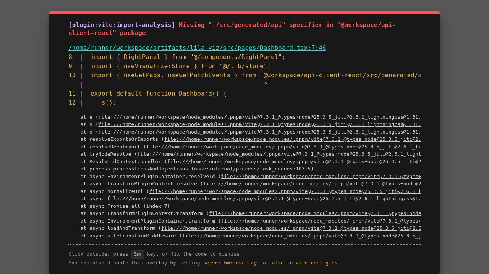

# LILA BLACK — Player Journey Visualizer

An internal analytics tool for Level Designers at Lila Games to explore player behavior on LILA BLACK maps using real match telemetry data.



---

## What It Does

- Visualize player movement paths, kills, deaths, loot events, and storm deaths on map overlays
- Scrub through match timelines or play back at 1×/2×/4×/8× speed
- Filter by map, date, and match — sorted by activity richness
- Toggle layers (paths, kills, deaths, loot, storm) and heatmap modes
- Click any player in the roster to isolate and track their individual journey

## Dataset

796 matches across 3 maps and 5 dates (Feb 10–14, 2026):

| Map | Matches |
|---|---|
| Ambrose Valley | 566 |
| Lockdown | 171 |
| Grand Rift | 59 |

89,016 total events · 245 unique human players

---

## Local Setup

### Prerequisites

- [Node.js](https://nodejs.org/) 18+
- [pnpm](https://pnpm.io/) 9+ (`npm i -g pnpm`)
- Python 3.9+ (for data pipeline only)

### 1. Run the data pipeline (first time only)

The raw parquet telemetry files are not included in this repo. If you have access to the `Resourses/` dataset:

```bash
cd Backend
pip install -r requirements.txt
python process_data.py
```

This reads all `.parquet` files from `../Resourses/` and writes:
- `frontend/artifacts/lila-viz/public/data/index.json`
- `frontend/artifacts/lila-viz/public/data/matches/{matchId}.json`

> The generated JSON files **are** included in this repo, so you can skip this step and run the frontend directly.

### 2. Run the frontend

```bash
cd frontend/artifacts/lila-viz
pnpm install
pnpm dev
```

Open [http://localhost:5173](http://localhost:5173)

> On Windows with Git Bash, use: `MSYS_NO_PATHCONV=1 pnpm dev`

### Build for production

```bash
pnpm build
# Output: frontend/artifacts/lila-viz/dist/
```

---

## Project Structure

```
lilablack/
├── Backend/
│   ├── process_data.py      # Parquet → JSON pipeline
│   └── requirements.txt
├── frontend/artifacts/lila-viz/
│   ├── src/
│   │   ├── components/      # MapViewer, Sidebar, Timeline, RightPanel
│   │   ├── lib/             # Zustand store, types, coordinate utils
│   │   └── pages/           # Dashboard (data loading)
│   └── public/data/         # Generated JSON (committed)
├── ARCHITECTURE.md
└── INSIGHTS.md
```

---

## Deliverables

- [x] Player Journey Visualization Tool (this repo)
- [x] Data pipeline (Backend/process_data.py)
- [x] Architecture document (ARCHITECTURE.md)
- [x] Gameplay insights (INSIGHTS.md)
